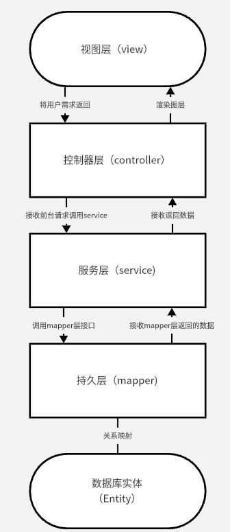
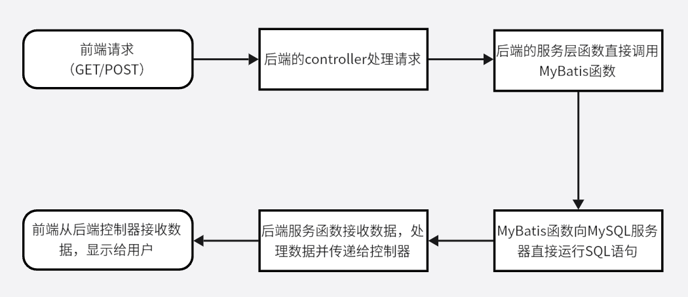
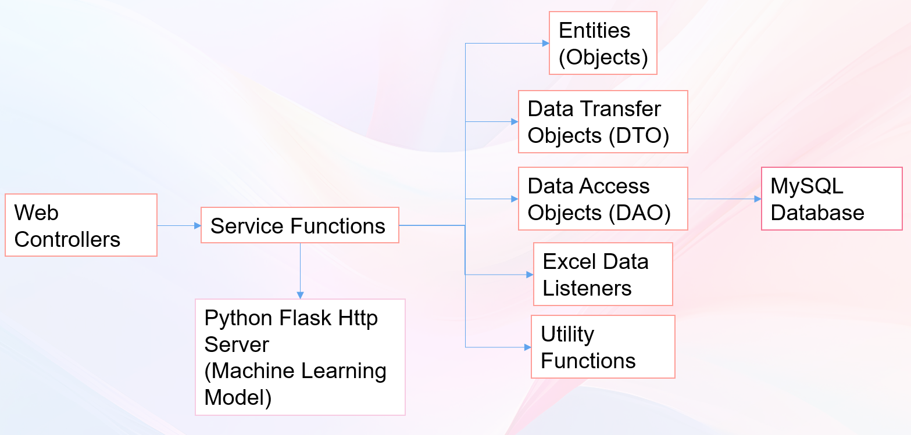
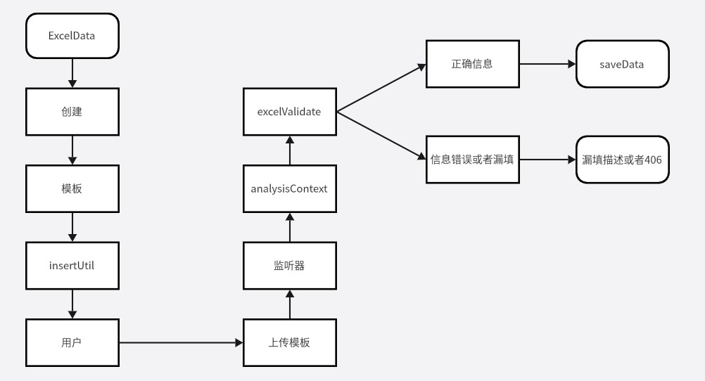
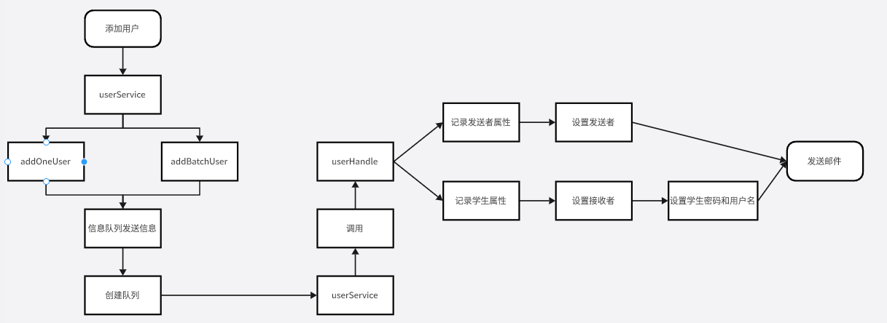
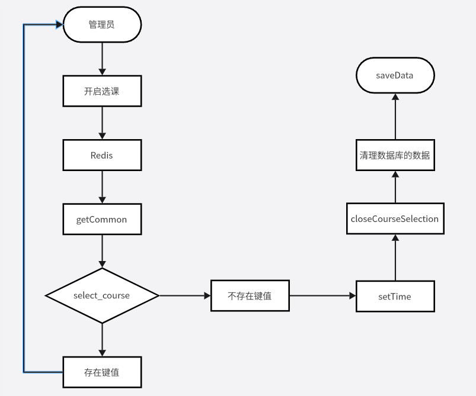

# 学生信息系统后端

## MVC框架
前端和后端的系统总体选用MVC模式搭建。系统总体的框架基于SpringBoot搭建。

## 系统总体运行框架
系统的前端和后端的交互工作流程。

## 后端系统运行流程
下图展示了，系统后端的总工作流程以及部署情况。

除此之外，后端还有
1.批量添加用户信息以及成绩上传功能。

2.为批量用户设置用户名密码等信息且发送邮件通知用户的功能。

3.管理员开启学生选课功能。

# EasyExcel技术栈
EasyExcel的用处以及工作流程如下图所示：

# ActiveMQ技术栈
ActiveMQ在本系统的作用是为了在处理大量学生注册的情况能够为每一个学生创建进程，发送邮件和设置学号密码等操作。

# Redis技术栈
Redis技术可以作为系统的缓冲池，在大量学生选课时，Redis会将部分的选课信息先存储起来，当一段时间之后才会将记录继续写入数据库，避免数据库崩溃的问题。

## 后端系统使用到的技术栈
1.SpringBoot
2.SpringSecurity
3.Mybatis
4.PageHelper
5.EasyExcel
6.Redis
7.ActiveMQ
8.OSS